# Complete Game Boy-Style Pokémon Game Design

<!-- PROJECT STATUS: ACTIVE -->
<!-- GIT REPOSITORY: https://github.com/vonksvenom/testepokqoder.git -->
<!-- PROJECT TYPE: WEB GAME -->
<!-- TECHNOLOGY: HTML5 Canvas + JavaScript -->

## Project Information

**Repository**: `https://github.com/vonksvenom/testepokqoder.git`  
**Status**: Design Phase Complete  
**Technology Stack**: HTML5 Canvas + JavaScript (ES6+)  
**Target Platform**: Web Browser (Desktop & Mobile)  

## Overview

This design outlines a complete, playable Game Boy-style Pokémon game that replicates the classic experience with modern web technologies. The game will be fully functional with automatic saving, multiple save slots, complete NPC dialogue systems, custom Pokémon creation, and utilize existing sprites and audio from online sources.

**Core Features:**
- Complete original Pokémon database (Generation 1 & 2)
- Custom Pokémon creation module
- Automatic save system with multiple save slots
- Full turn-based battle system
- Overworld exploration with NPC interactions
- Asset management using existing online resources

## Technology Stack & Dependencies

### Primary Technologies
- **Platform**: Web-based (HTML5 Canvas + JavaScript)
- **Graphics**: 2D Canvas rendering with Game Boy color palette
- **Audio**: Web Audio API for music and sound effects
- **Storage**: Browser LocalStorage with IndexedDB fallback
- **Assets**: External URLs for sprites, music, and sound effects

### Asset Sources Strategy
- **Pokémon Sprites**: PokeAPI sprite repository
- **Music**: Game Boy soundtrack archives
- **Sound Effects**: Classic Game Boy audio libraries
- **Tilesets**: Sprite resource community archives

## Architecture

### System Architecture Overview

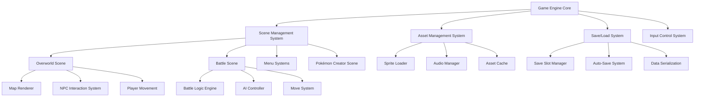

### File Organization Structure

```
pokemon-game/
├── index.html (Entry point)
├── src/
│   ├── core/ (Game engine fundamentals)
│   ├── systems/ (Save, asset, audio management)
│   ├── scenes/ (Different game screens)
│   ├── pokemon/ (Pokémon data and logic)
│   ├── battle/ (Battle system components)
│   ├── world/ (Map and NPC systems)
│   ├── ui/ (User interface components)
│   └── data/ (Game data files)
├── assets/ (Downloaded sprites, audio)
└── saves/ (Player save files)
```

## Pokémon Database System

### Individual Pokémon Data Files

Each Pokémon will have its own dedicated file containing:

| Data Category | Description |
|---------------|-------------|
| **Basic Info** | ID, name, types, description |
| **Base Stats** | HP, Attack, Defense, Sp.Attack, Sp.Defense, Speed |
| **Move Learning** | Level-up moves, TM compatibility |
| **Evolution Data** | Evolution methods, requirements, target species |
| **Sprite References** | Front/back sprite IDs, shiny variants |
| **Audio References** | Cry sound file ID |
| **Game Mechanics** | Catch rate, gender ratio, egg groups |

### Database Organization

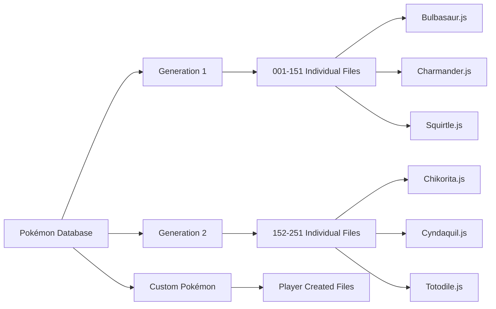

## Custom Pokémon Creation System

### Creation Process Flow

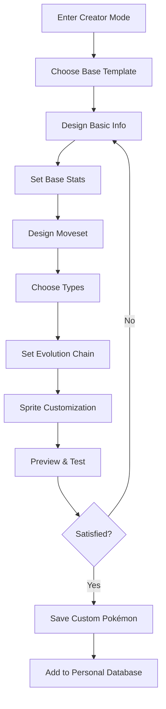

### Customization Options

| Feature | Options Available |
|---------|------------------|
| **Basic Info** | Name, description, height, weight |
| **Stats** | Adjustable base stats with total limit |
| **Types** | Any combination of existing types |
| **Moves** | Select from existing move pool |
| **Evolution** | Optional evolution chain design |
| **Sprites** | Color palette modification of base sprites |
| **Audio** | Choose from existing cry library |

## Detailed Save System Architecture

### Save Data Organization

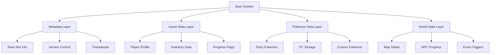

### Auto-Save Implementation

| Trigger Event | Save Priority | Data Scope |
|---------------|---------------|------------|
| **Location Change** | High | Full game state |
| **Pokemon Catch** | High | Pokemon + inventory |
| **Battle Victory** | Medium | Party + money |
| **Item Use** | Low | Inventory only |
| **Time Interval** | Low | Quick state snapshot |

### Save Slot Management

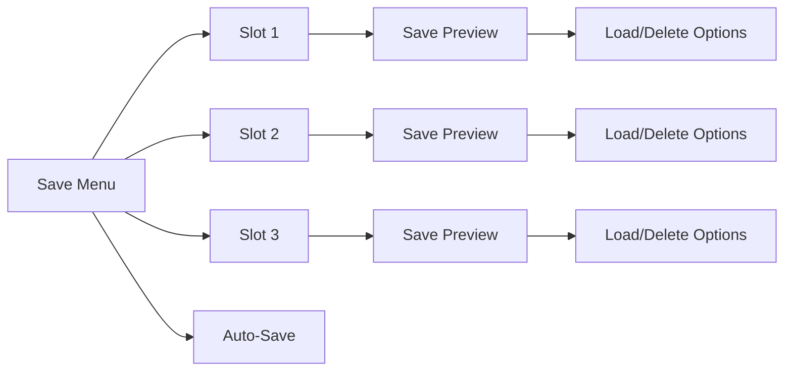

## Custom Pokémon Creator Deep Dive

### Creation Workflow

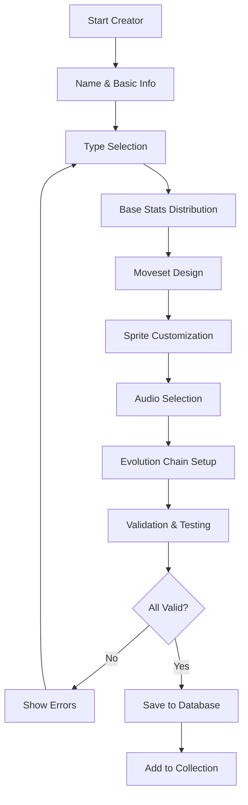

### Stat Balance System

| Stat Total Range | Tier Classification | Usage Restriction |
|------------------|--------------------|-----------------|
| **300-400** | Weak Tier | Starter alternatives |
| **401-500** | Standard Tier | Main game usage |
| **501-600** | Strong Tier | Late game encounters |
| **601-720** | Legendary Tier | Special events only |

### Sprite Customization Options

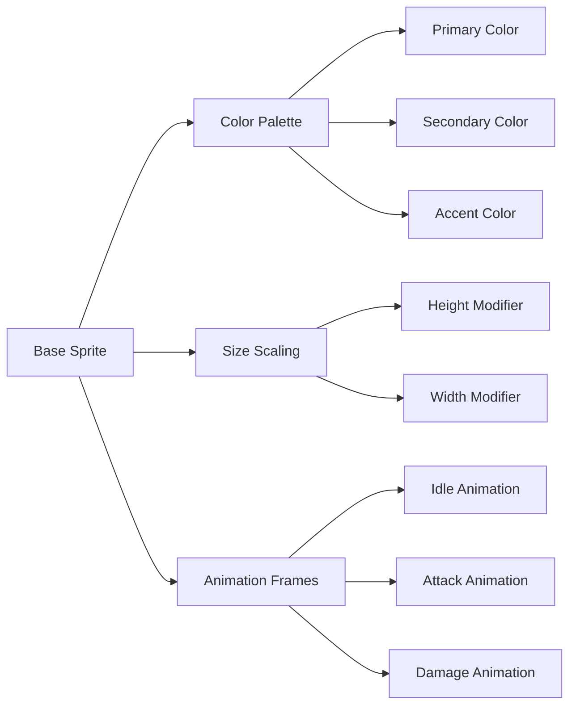

### Custom Move Creation

| Move Element | Customization Options | Validation Rules |
|--------------|----------------------|------------------|
| **Name** | Text input (20 char max) | No duplicates, appropriate content |
| **Type** | Dropdown selection | Must match Pokémon types |
| **Power** | 1-150 range | Balanced with PP and accuracy |
| **Accuracy** | 50-100% range | Higher power = lower accuracy |
| **PP** | 5-40 range | Inversely related to power |
| **Effect** | Predefined templates | Status, stat changes, special |

## NPC Dialogue System Details

### Dialogue Tree Structure

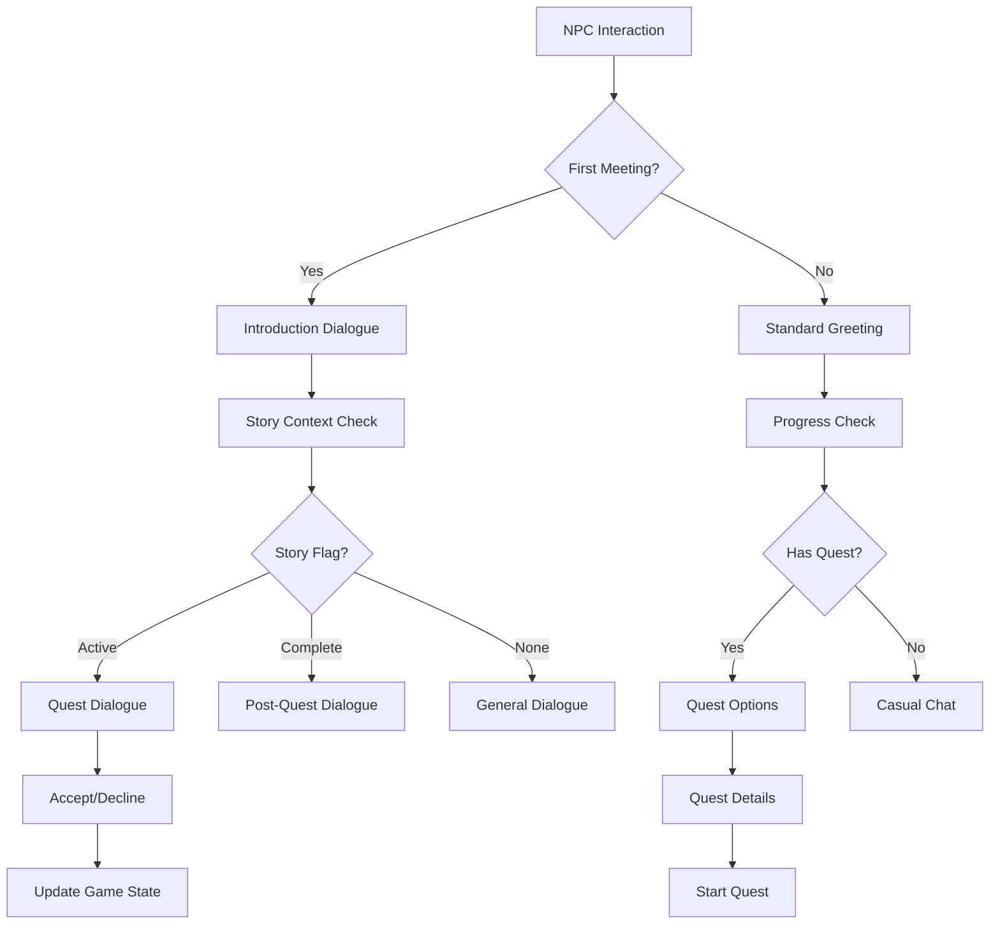

### Character Memory System

| Memory Type | Storage Duration | Affects |
|-------------|------------------|----------|
| **First Meeting** | Permanent | Initial dialogue options |
| **Last Interaction** | Session-based | Greeting variations |
| **Quest Status** | Until completion | Available dialogue paths |
| **Battle History** | Permanent | Trainer rematches |
| **Gift Given** | Permanent | Prevents duplicate rewards |

### Dynamic Dialogue Features

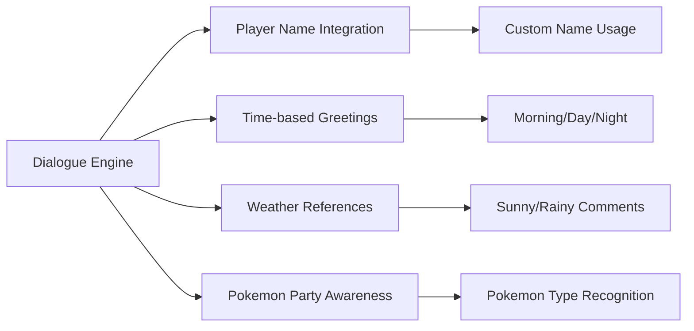

## World Map System Architecture

### Map Loading Strategy

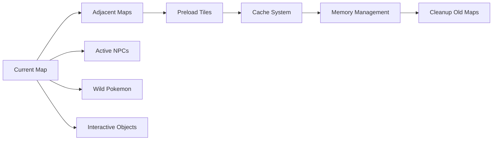

### Map Categories

| Map Type | Size | Features | Loading Method |
|----------|------|----------|----------------|
| **Towns** | 20x20 tiles | Buildings, NPCs, shops | Full preload |
| **Routes** | 30x50 tiles | Grass, trainers, items | Sectioned loading |
| **Buildings** | 10x15 tiles | Interior NPCs, items | Instant load |
| **Dungeons** | 50x50 tiles | Puzzles, wild Pokemon | Progressive load |

### Collision Detection

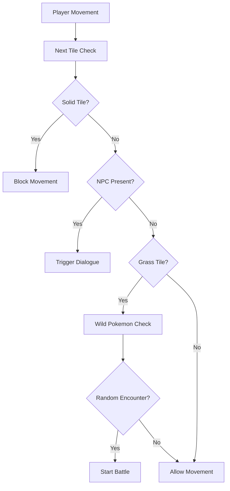

### Save Data Categories

| Category | Contains |
|----------|----------|
| **Player Profile** | Name, location, play time, money, badges |
| **Pokémon Data** | Party, PC boxes, custom created Pokémon |
| **World Progress** | Visited locations, completed events, NPC states |
| **Inventory** | Items, key items, TMs, Pokéballs |
| **Game Settings** | Audio levels, text speed, battle animations |

### Auto-Save Features

- **Trigger Events**: Location changes, Pokémon catches, important story events
- **Frequency**: Every 30 seconds during gameplay
- **Recovery**: Automatic corruption detection and backup restoration
- **Location**: Browser local storage with cloud backup option

## Battle System Architecture

### Turn-Based Combat Flow

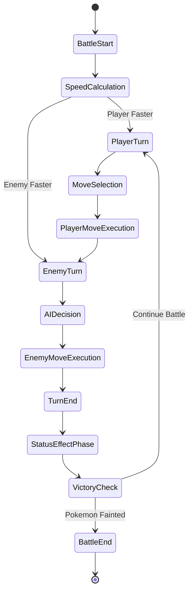

### Battle Types & Mechanics

| Battle Type | Characteristics | Special Rules |
|-------------|-----------------|---------------|
| **Wild Pokémon** | Single opponent, catch possible | Can flee, lower AI difficulty |
| **Trainer Battle** | 1-6 Pokémon team | No fleeing, prize money reward |
| **Gym Leader** | Themed team, higher difficulty | Badge reward, signature moves |
| **Elite Four** | Championship level | Perfect movesets, advanced AI |
| **Rival Battle** | Story progression | Dynamic team based on player choices |

### Damage Calculation System

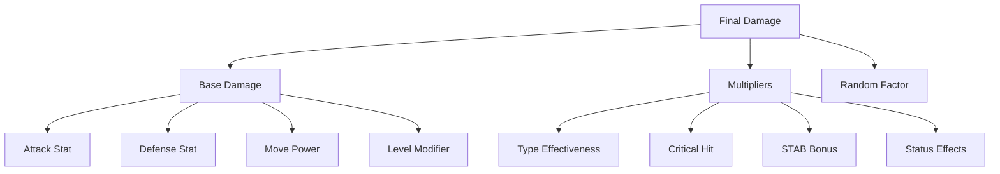

### Status Conditions

| Status | Effect | Duration | Cure Methods |
|--------|--------|----------|-------------|
| **Poison** | Lose 1/8 HP each turn | Until healed | Antidote, switching |
| **Paralysis** | 25% can't move, Speed halved | Until healed | Paralyze Heal |
| **Sleep** | Can't move | 1-7 turns | Wake naturally, items |
| **Burn** | Lose 1/16 HP, Attack halved | Until healed | Burn Heal |
| **Freeze** | Can't move | Until thawed | Fire moves, items |

## Battle System Design

### Battle Flow Architecture

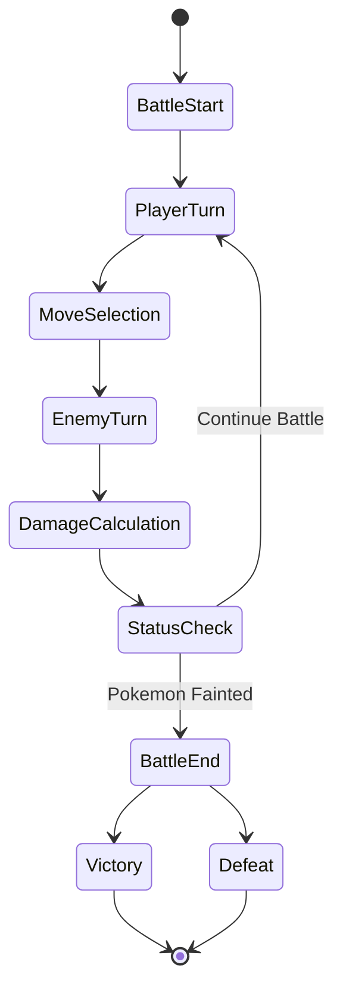

### Battle Mechanics

| System | Implementation |
|--------|----------------|
| **Turn Order** | Speed-based with priority moves |
| **Damage Calculation** | Type effectiveness, stats, random factors |
| **Status Effects** | Poison, paralysis, sleep, burn, freeze |
| **AI Behavior** | Smart move selection, type advantages |
| **Animations** | Sprite-based attack animations |

## World & NPC System

### Map Structure

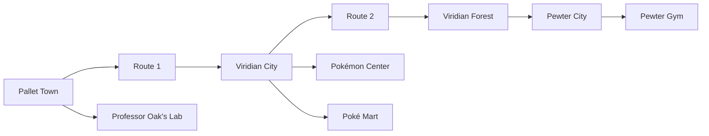

### NPC Interaction System

| NPC Type | Interaction Features |
|----------|---------------------|
| **Professor Oak** | Starter selection, Pokédex, research tasks |
| **Gym Leaders** | Battle challenges, badge rewards |
| **Nurse Joy** | Pokémon healing, PC access |
| **Shop Clerks** | Item purchasing, inventory management |
| **Wild Trainers** | Battle encounters, prize money |
| **Story Characters** | Plot advancement, quest giving |

### Dialogue System Features

- **Branching Conversations**: Multiple choice responses
- **Character Memory**: NPCs remember previous interactions
- **Story Progression**: Dialogue changes based on game progress
- **Battle Taunts**: Dynamic phrases during trainer battles
- **Tutorials**: Interactive learning for new players

## Asset Management Strategy

### External Resource Integration

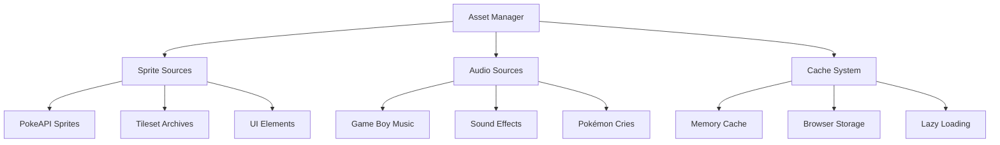

### Asset Categories

| Asset Type | Source Strategy | Cache Method |
|------------|----------------|--------------|
| **Pokémon Sprites** | PokeAPI official repository | Persistent browser cache |
| **Music Tracks** | Classic Game Boy soundtracks | Stream with local buffer |
| **Sound Effects** | Retro gaming archives | Pre-load essential sounds |
| **Map Tilesets** | Sprite ripping communities | Load per area |
| **UI Graphics** | Game Boy interface recreations | Pre-load all UI elements |

## User Interface Design

### Screen Layout Organization

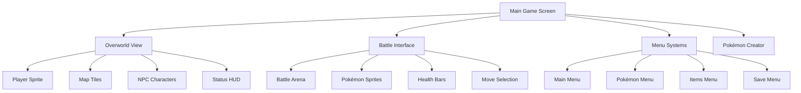

### Interface Components

| Screen | Primary Elements |
|--------|------------------|
| **Overworld** | Player character, map tiles, NPCs, dialogue boxes |
| **Battle** | Pokémon sprites, health bars, move buttons, battle text |
| **Menus** | List interfaces, Pokémon stats, item management |
| **Creator** | Stat sliders, type selectors, sprite preview |
| **Save System** | Slot selection, save previews, load confirmations |

## Game Flow & Progression System

### Story Progression

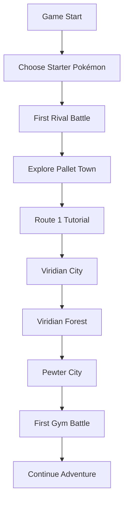

### Player Progression Elements

| Element | Description | Unlocking Criteria |
|---------|-------------|--------------------|
| **Pokédex** | Pokémon collection tracker | Receive from Professor Oak |
| **Gym Badges** | Battle achievement markers | Defeat Gym Leaders |
| **HM Moves** | Overworld abilities | Story progression rewards |
| **Elite Four** | End-game challenge | Collect all 8 badges |
| **Custom Creator** | Pokémon design tool | Defeat first Gym Leader |
| **PC Storage** | Extended Pokémon storage | Visit first Pokémon Center |

## Audio & Visual Design

### Game Boy Aesthetic

| Visual Element | Design Approach |
|----------------|------------------|
| **Color Palette** | Classic Game Boy green monochrome with color options |
| **Sprite Style** | 16x16 pixel sprites with limited animation frames |
| **Screen Resolution** | 160x144 pixel canvas with scaling options |
| **UI Elements** | Chunky, pixelated buttons and menus |
| **Text Font** | Classic Game Boy typography |

### Audio Implementation

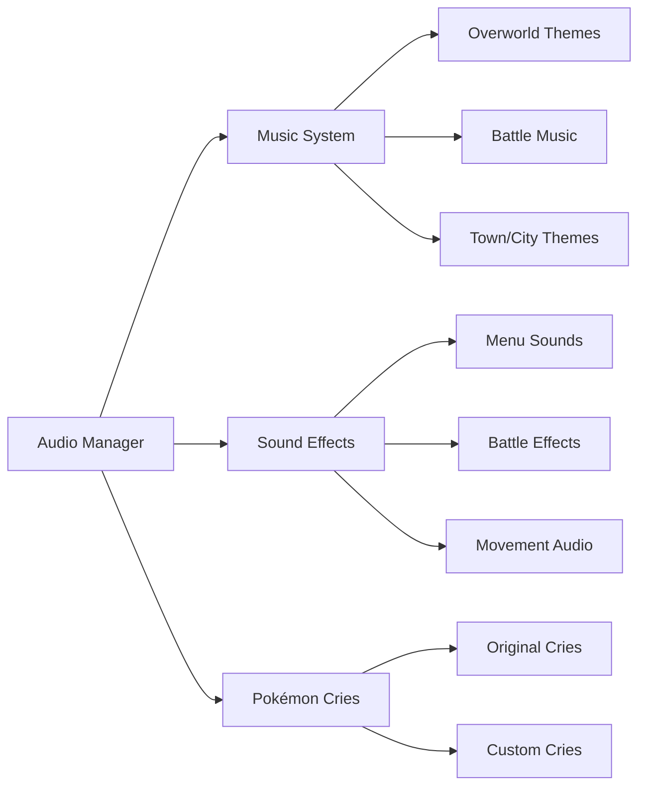

## Advanced Features

### Pokémon AI System

| AI Type | Behavior Pattern |
|---------|------------------|
| **Wild Pokémon** | Aggressive moves, flee chance |
| **Trainer AI** | Type advantages, strategic switching |
| **Gym Leaders** | Signature moves, difficulty scaling |
| **Elite Four** | Advanced strategies, perfect movesets |

### Custom Pokémon Validation

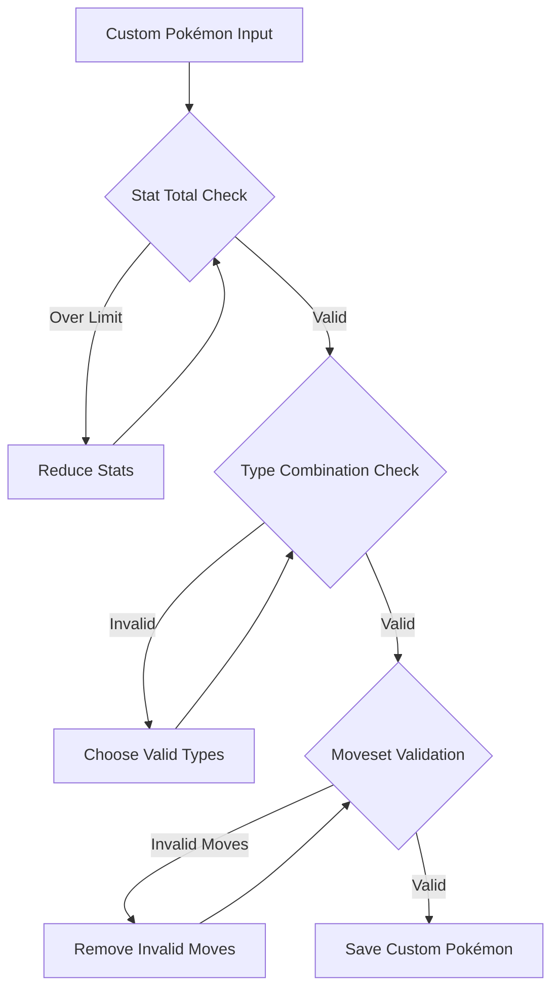

### Trading System (Future Feature)

| Feature | Implementation Plan |
|---------|--------------------|
| **Local Trading** | Direct file exchange between save slots |
| **QR Code Export** | Generate shareable Pokémon codes |
| **Community Database** | Online custom Pokémon sharing |

## Performance Optimization

### Memory Management

| Resource | Optimization Strategy |
|----------|----------------------|
| **Sprites** | Lazy loading, texture atlases |
| **Audio** | Compressed formats, streaming |
| **Save Data** | Compression, incremental saves |
| **Battle Animations** | Frame skipping options |

### Loading Performance

```mermaid
graph TB
    A[Game Launch] --> B[Essential Assets]
    B --> C[Game Ready]
    C --> D[Background Loading]
    D --> E[Additional Pokémon]
    D --> F[Extra Audio]
    D --> G[Advanced Features]
```

## Testing Strategy

### Testing Categories

| Test Type | Focus Areas |
|-----------|-------------|
| **Functionality** | Save/load, battle mechanics, NPC interactions |
| **Performance** | Asset loading, memory usage, rendering speed |
| **Compatibility** | Different browsers, mobile devices |
| **User Experience** | Game flow, interface responsiveness |
| **Data Integrity** | Save file corruption, custom Pokémon validation |

### Quality Assurance

- **Battle System**: All move interactions, status effects, AI behavior
- **Save System**: Multiple slot management, auto-save reliability
- **Custom Creator**: Stat validation, sprite rendering, data persistence
- **Asset Loading**: Fallback systems, error handling, cache management
- **Cross-Platform**: Desktop browsers, mobile compatibility

## Development Phases

### Phase 1: Core Foundation
- Game engine setup
- Basic asset loading
- Simple overworld movement
- Save/load system

### Phase 2: Battle System
- Turn-based combat
- Pokémon data integration
- Move effects and calculations
- Basic AI implementation

### Phase 3: World Building
- Map system implementation
- NPC dialogue system
- Story progression
- Gym battles

### Phase 4: Advanced Features
- Custom Pokémon creator
- Enhanced AI
- Audio implementation
- Polish and optimization

## Asset Integration Strategy

### External Asset Sources

| Asset Category | Primary Source | Backup Source | Format |
|----------------|---------------|---------------|--------|
| **Pokémon Sprites** | PokeAPI GitHub | Bulbapedia | PNG |
| **Trainer Sprites** | Spriters Resource | Fan Communities | PNG |
| **Music Tracks** | Zophar's Domain | YouTube Audio | MP3/OGG |
| **Sound Effects** | Classic Gaming | Freesound | WAV/OGG |
| **Map Tilesets** | Spriters Resource | ROM Extractions | PNG |
| **UI Elements** | Game Boy Museums | Recreation Projects | PNG |

### Asset Pipeline

```mermaid
flowchart LR
    A[Asset URLs Database] --> B[Download Manager]
    B --> C[Format Validation]
    C --> D[Optimization]
    D --> E[Cache Storage]
    
    F[Fallback System] --> G[Local Placeholders]
    F --> H[Alternative Sources]
    
    E --> I[Runtime Loading]
    G --> I
    H --> I
```

### Asset Optimization

| Optimization | Target | Method | Benefit |
|--------------|--------|--------|---------|
| **Sprite Compression** | All images | WebP conversion | 30% size reduction |
| **Audio Compression** | Music files | OGG Vorbis | 50% size reduction |
| **Texture Atlasing** | UI sprites | Combined images | Fewer HTTP requests |
| **Lazy Loading** | Non-critical assets | On-demand fetch | Faster startup |

## Deployment Architecture

### Hosting Strategy

```mermaid
graph TB
    A[GitHub Repository] --> B[GitHub Pages]
    A --> C[Netlify]
    A --> D[Vercel]
    
    B --> E[Static Hosting]
    C --> F[Build Optimization]
    D --> G[Edge Distribution]
    
    H[CDN Assets] --> I[Asset Delivery]
    J[Local Storage] --> K[Save Data]
```

### Build Pipeline

| Stage | Process | Tools | Output |
|-------|---------|-------|--------|
| **Development** | Live coding | Local server | Debug build |
| **Testing** | Asset validation | Custom scripts | Test reports |
| **Staging** | Pre-production | GitHub Actions | Staging build |
| **Production** | Optimized build | Webpack/Vite | Production bundle |

### Platform Compatibility

| Platform | Support Level | Specific Considerations |
|----------|---------------|------------------------|
| **Desktop Chrome** | Full | Primary development target |
| **Desktop Firefox** | Full | Canvas API compatibility |
| **Desktop Safari** | Partial | Audio format limitations |
| **Mobile Chrome** | Partial | Touch controls, performance |
| **Mobile Safari** | Limited | Audio policy restrictions |
| **Edge** | Full | Modern standards support |

## Quality Assurance Plan

### Testing Phases

```mermaid
flowchart TD
    A[Development Testing] --> B[Component Testing]
    B --> C[Integration Testing]
    C --> D[System Testing]
    D --> E[User Acceptance Testing]
    
    B --> F[Battle System]
    B --> G[Save System]
    B --> H[Asset Loading]
    
    C --> I[Scene Transitions]
    C --> J[Data Persistence]
    C --> K[Performance]
    
    D --> L[Full Gameplay]
    D --> M[Edge Cases]
    D --> N[Error Handling]
```

### Performance Benchmarks

| Metric | Target | Measurement Method |
|--------|--------|-----------------|
| **Initial Load Time** | < 5 seconds | Time to first playable |
| **Asset Loading** | < 2 seconds | Individual asset fetch |
| **Battle Transitions** | < 1 second | Scene switch timing |
| **Save Operations** | < 500ms | Data write completion |
| **Memory Usage** | < 512MB | Browser memory profiler |
| **Frame Rate** | 60 FPS | Canvas rendering performance |

## Project Timeline

### Development Roadmap

```mermaid
gantt
    title Pokémon Game Development Timeline
    dateFormat  YYYY-MM-DD
    section Phase 1
    Core Engine Setup     :active, phase1, 2024-01-01, 14d
    Asset System         :phase1a, after phase1, 7d
    Basic UI             :phase1b, after phase1a, 7d
    
    section Phase 2
    Battle System        :phase2, after phase1b, 21d
    Pokémon Database     :phase2a, after phase1b, 14d
    AI Implementation    :phase2b, after phase2a, 7d
    
    section Phase 3
    World System         :phase3, after phase2, 21d
    NPC Dialogue         :phase3a, after phase2, 14d
    Map Integration      :phase3b, after phase3a, 7d
    
    section Phase 4
    Custom Creator       :phase4, after phase3, 14d
    Advanced Features    :phase4a, after phase4, 7d
    Polish & Testing     :phase4b, after phase4a, 14d
```

### Milestone Deliverables

| Phase | Milestone | Deliverable | Success Criteria |
|-------|-----------|-------------|------------------|
| **1** | Core Foundation | Basic game engine | Player movement, basic UI |
| **2** | Battle System | Combat mechanics | Full turn-based battles |
| **3** | World Building | Explorable world | NPC interactions, map navigation |
| **4** | Feature Complete | Full game | Custom Pokémon, save system |
| **5** | Launch Ready | Polished product | Performance optimized, tested |

## Risk Management

### Technical Risks

| Risk | Probability | Impact | Mitigation Strategy |
|------|-------------|--------|-----------------|
| **Asset Copyright** | Medium | High | Use only public domain/permissive sources |
| **Performance Issues** | High | Medium | Progressive optimization, fallbacks |
| **Browser Compatibility** | Medium | Medium | Polyfills, feature detection |
| **Save Data Corruption** | Low | High | Backup systems, validation |
| **Asset Loading Failures** | Medium | Low | Fallback images, retry logic |

### Project Risks

| Risk | Mitigation |
|------|------------|
| **Scope Creep** | Detailed phase planning, feature freeze dates |
| **Technical Debt** | Regular refactoring, code reviews |
| **Performance Bottlenecks** | Early profiling, optimization sprints |
| **User Experience Issues** | Continuous testing, feedback integration |

## Success Metrics

### Functional Requirements

- [ ] Complete Pokémon database (Generation 1 & 2)
- [ ] Custom Pokémon creation system
- [ ] Turn-based battle system
- [ ] Save/load with multiple slots
- [ ] Auto-save functionality
- [ ] NPC dialogue system
- [ ] Overworld exploration
- [ ] Asset management system

### Performance Requirements

- [ ] 60 FPS gameplay on desktop
- [ ] < 5 second initial load time
- [ ] < 512MB memory usage
- [ ] Cross-browser compatibility
- [ ] Mobile device support

### User Experience Requirements

- [ ] Intuitive Game Boy-style interface
- [ ] Responsive controls
- [ ] Clear visual feedback
- [ ] Engaging audio experience
- [ ] Seamless save/load experience

## Future Enhancement Opportunities

### Post-Launch Features

| Feature | Priority | Complexity | User Impact |
|---------|----------|------------|-------------|
| **Online Trading** | High | High | Very High |
| **Tournament Mode** | Medium | Medium | High |
| **Advanced AI** | Low | High | Medium |
| **Additional Generations** | High | Medium | Very High |
| **Multiplayer Battles** | Medium | Very High | High |
| **Mobile App Version** | High | High | Very High |

### Community Features

```mermaid
graph LR
    A[Community Hub] --> B[Custom Pokémon Sharing]
    A --> C[Battle Replays]
    A --> D[Leaderboards]
    A --> E[User Forums]
    
    B --> F[Rating System]
    B --> G[Download Counter]
    
    C --> H[Video Export]
    C --> I[Share Links]
    
    D --> J[Speed Run Times]
    D --> K[Battle Win Rates]
```