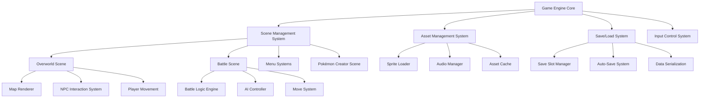
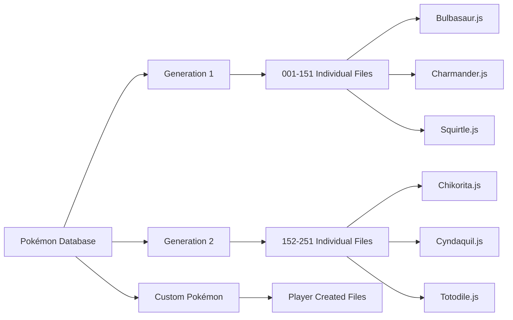
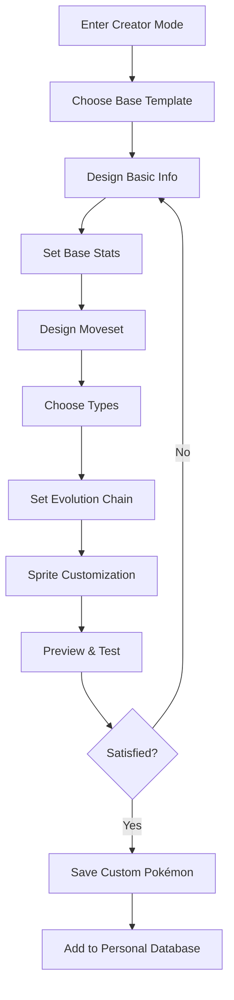
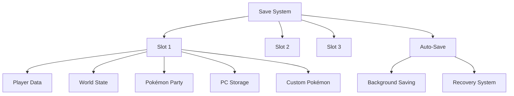
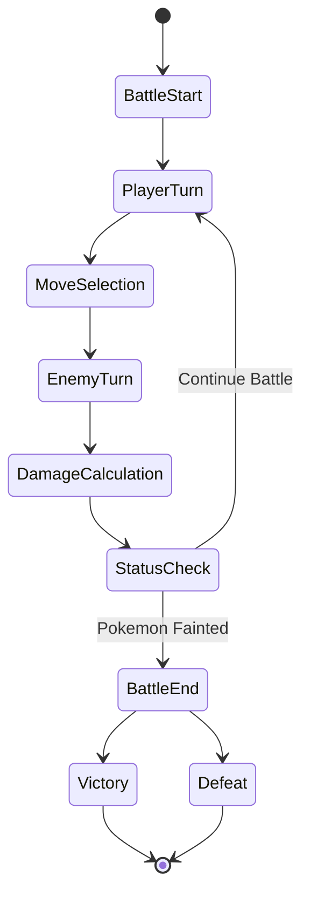
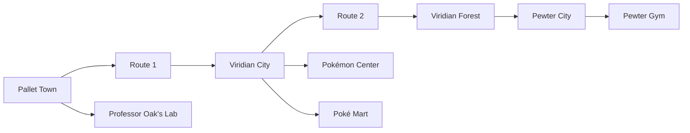
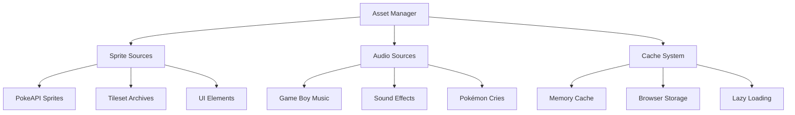
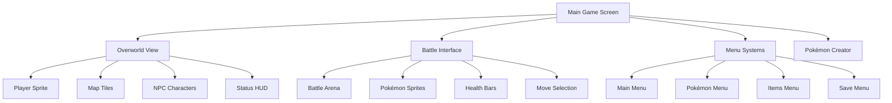

# Complete Game Boy-Style Pokémon Game Design

## Overview

This design outlines a complete, playable Game Boy-style Pokémon game that replicates the classic experience with modern web technologies. The game will be fully functional with automatic saving, multiple save slots, complete NPC dialogue systems, custom Pokémon creation, and utilize existing sprites and audio from online sources.

**Core Features:**
- Complete original Pokémon database (Generation 1 & 2)
- Custom Pokémon creation module
- Automatic save system with multiple save slots
- Full turn-based battle system
- Overworld exploration with NPC interactions
- Asset management using existing online resources

## Technology Stack & Dependencies

### Primary Technologies
- **Platform**: Web-based (HTML5 Canvas + JavaScript)
- **Graphics**: 2D Canvas rendering with Game Boy color palette
- **Audio**: Web Audio API for music and sound effects
- **Storage**: Browser LocalStorage with IndexedDB fallback
- **Assets**: External URLs for sprites, music, and sound effects

### Asset Sources Strategy
- **Pokémon Sprites**: PokeAPI sprite repository
- **Music**: Game Boy soundtrack archives
- **Sound Effects**: Classic Game Boy audio libraries
- **Tilesets**: Sprite resource community archives

## Architecture

### System Architecture Overview



### File Organization Structure

```
pokemon-game/
├── index.html (Entry point)
├── src/
│   ├── core/ (Game engine fundamentals)
│   ├── systems/ (Save, asset, audio management)
│   ├── scenes/ (Different game screens)
│   ├── pokemon/ (Pokémon data and logic)
│   ├── battle/ (Battle system components)
│   ├── world/ (Map and NPC systems)
│   ├── ui/ (User interface components)
│   └── data/ (Game data files)
├── assets/ (Downloaded sprites, audio)
└── saves/ (Player save files)
```

## Pokémon Database System

### Individual Pokémon Data Files

Each Pokémon will have its own dedicated file containing:

| Data Category | Description |
|---------------|-------------|
| **Basic Info** | ID, name, types, description |
| **Base Stats** | HP, Attack, Defense, Sp.Attack, Sp.Defense, Speed |
| **Move Learning** | Level-up moves, TM compatibility |
| **Evolution Data** | Evolution methods, requirements, target species |
| **Sprite References** | Front/back sprite IDs, shiny variants |
| **Audio References** | Cry sound file ID |
| **Game Mechanics** | Catch rate, gender ratio, egg groups |

### Database Organization



## Custom Pokémon Creation System

### Creation Process Flow



### Customization Options

| Feature | Options Available |
|---------|------------------|
| **Basic Info** | Name, description, height, weight |
| **Stats** | Adjustable base stats with total limit |
| **Types** | Any combination of existing types |
| **Moves** | Select from existing move pool |
| **Evolution** | Optional evolution chain design |
| **Sprites** | Color palette modification of base sprites |
| **Audio** | Choose from existing cry library |

## Save System Architecture

### Save Slot Management



### Save Data Categories

| Category | Contains |
|----------|----------|
| **Player Profile** | Name, location, play time, money, badges |
| **Pokémon Data** | Party, PC boxes, custom created Pokémon |
| **World Progress** | Visited locations, completed events, NPC states |
| **Inventory** | Items, key items, TMs, Pokéballs |
| **Game Settings** | Audio levels, text speed, battle animations |

### Auto-Save Features

- **Trigger Events**: Location changes, Pokémon catches, important story events
- **Frequency**: Every 30 seconds during gameplay
- **Recovery**: Automatic corruption detection and backup restoration
- **Location**: Browser local storage with cloud backup option

## Battle System Design

### Battle Flow Architecture



### Battle Mechanics

| System | Implementation |
|--------|----------------|
| **Turn Order** | Speed-based with priority moves |
| **Damage Calculation** | Type effectiveness, stats, random factors |
| **Status Effects** | Poison, paralysis, sleep, burn, freeze |
| **AI Behavior** | Smart move selection, type advantages |
| **Animations** | Sprite-based attack animations |

## World & NPC System

### Map Structure



### NPC Interaction System

| NPC Type | Interaction Features |
|----------|---------------------|
| **Professor Oak** | Starter selection, Pokédex, research tasks |
| **Gym Leaders** | Battle challenges, badge rewards |
| **Nurse Joy** | Pokémon healing, PC access |
| **Shop Clerks** | Item purchasing, inventory management |
| **Wild Trainers** | Battle encounters, prize money |
| **Story Characters** | Plot advancement, quest giving |

### Dialogue System Features

- **Branching Conversations**: Multiple choice responses
- **Character Memory**: NPCs remember previous interactions
- **Story Progression**: Dialogue changes based on game progress
- **Battle Taunts**: Dynamic phrases during trainer battles
- **Tutorials**: Interactive learning for new players

## Asset Management Strategy

### External Resource Integration



### Asset Categories

| Asset Type | Source Strategy | Cache Method |
|------------|----------------|--------------|
| **Pokémon Sprites** | PokeAPI official repository | Persistent browser cache |
| **Music Tracks** | Classic Game Boy soundtracks | Stream with local buffer |
| **Sound Effects** | Retro gaming archives | Pre-load essential sounds |
| **Map Tilesets** | Sprite ripping communities | Load per area |
| **UI Graphics** | Game Boy interface recreations | Pre-load all UI elements |

## User Interface Design

### Screen Layout Organization



### Interface Components

| Screen | Primary Elements |
|--------|------------------|
| **Overworld** | Player character, map tiles, NPCs, dialogue boxes |
| **Battle** | Pokémon sprites, health bars, move buttons, battle text |
| **Menus** | List interfaces, Pokémon stats, item management |
| **Creator** | Stat sliders, type selectors, sprite preview |
| **Save System** | Slot selection, save previews, load confirmations |

## Testing Strategy

### Testing Categories

| Test Type | Focus Areas |
|-----------|-------------|
| **Functionality** | Save/load, battle mechanics, NPC interactions |
| **Performance** | Asset loading, memory usage, rendering speed |
| **Compatibility** | Different browsers, mobile devices |
| **User Experience** | Game flow, interface responsiveness |
| **Data Integrity** | Save file corruption, custom Pokémon validation |

### Quality Assurance

- **Battle System**: All move interactions, status effects, AI behavior
- **Save System**: Multiple slot management, auto-save reliability
- **Custom Creator**: Stat validation, sprite rendering, data persistence
- **Asset Loading**: Fallback systems, error handling, cache management
- **Cross-Platform**: Desktop browsers, mobile compatibility